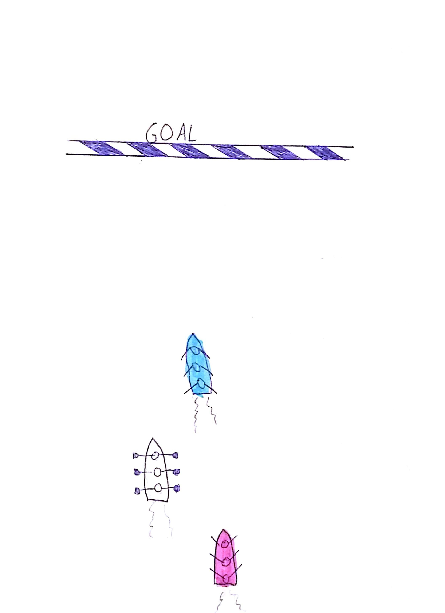
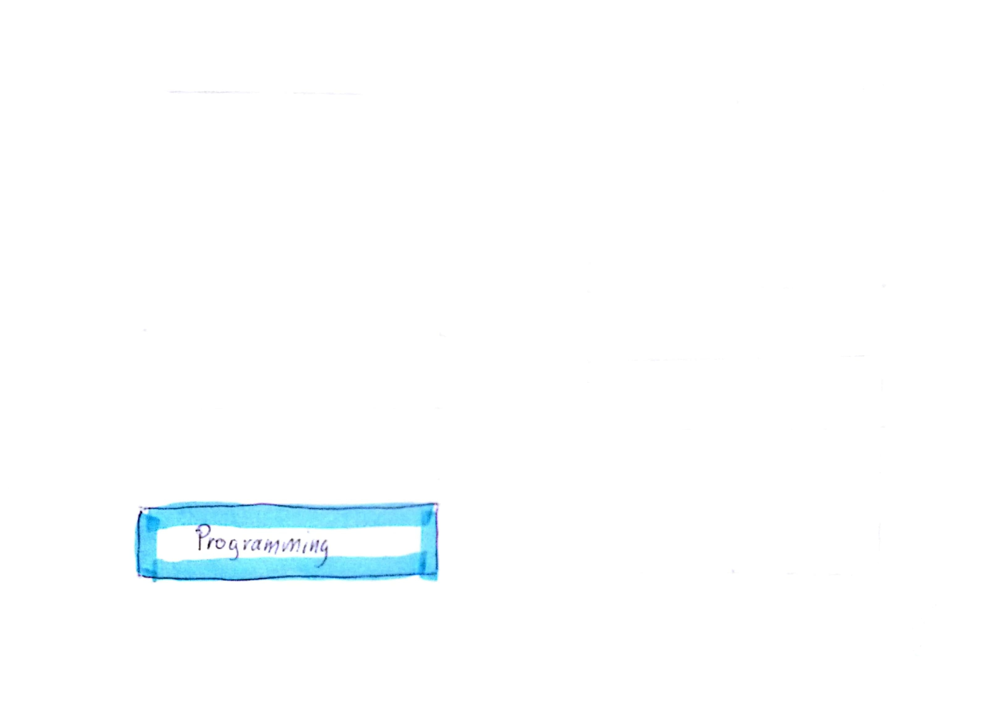
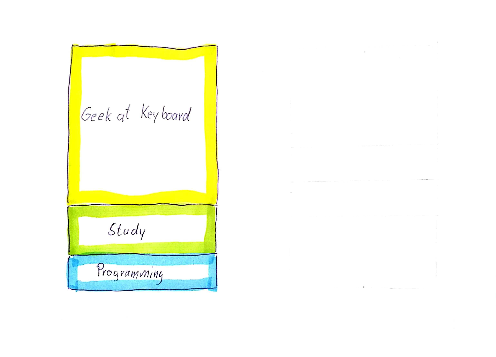
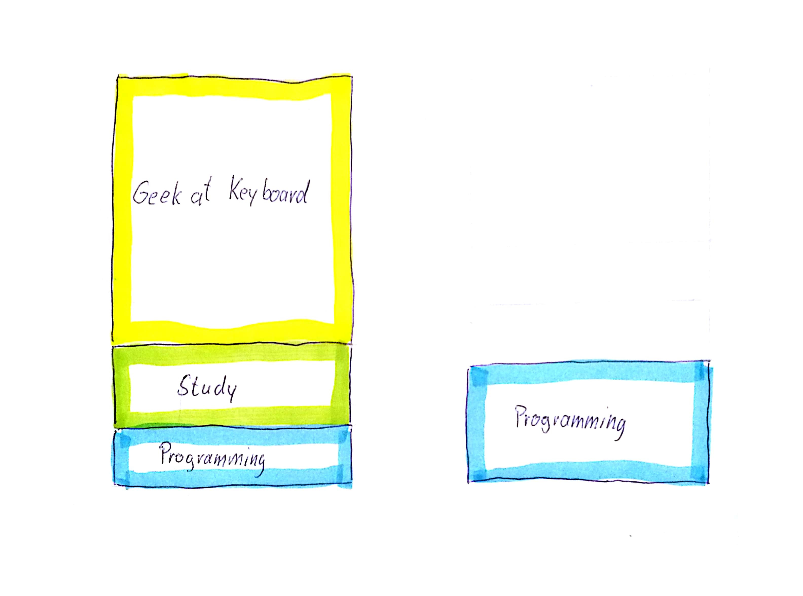
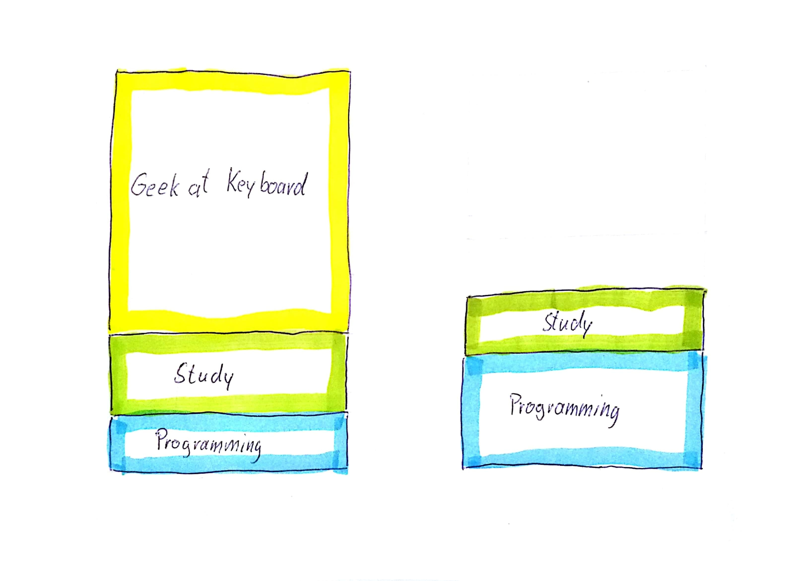

Note: But my team are is just ignorant.

??VERTICAL

Note:
* They ignore the fact that their performance slows down.
* They ignore the bad impression they make to the rest of the company.
* They prefer to accuse the PO for not giving them time to clean up the code.

??VERTICAL

Note:
* They think TDD is a waste of time. They will never do TDD.

??VERTICAL

Note:
It is like explaining me that I loose weight. And of course I know I should. But doing so is way much harder.

??VERTICAL

"There are no bad teams, there are only bad leaders."
Note: So we should plan some physical exercise I suppose? :) But back to your tdd issue: There are no bad teams, only bad leaders. Let me tell you a story:

??VERTICAL

Note: Part of the Navy seals training is a very tough rowing boat race in the midth of the pacific ocean. Three Teams had to cross a distance of several kilometers between two US Navy war ships.

??VERTICAL

Note: One time we did an experiment. After half of the track we exchanged the leaders of the two teams. What do you think happened? 

??VERTICAL

Note: I'll tell you. Of course the good team with the bad leader was able to hold the pol position quite a time. But the former bad team with the new good leader catched up very soon. And just a few meters before goal, the bad team overtook the good team and won. How would you explain that?

??VERTICAL
## The good leader
* was confident that he could make it <!-- .element: class="fragment" -->
* convinced the team to follow him <!-- .element: class="fragment" -->
* instructed the underperformers <!-- .element: class="fragment" -->
Note: The good leader is confident that his team can make it. He is able to convince the team to do what is to do. And if somebody in the team can not keep pace, he will teach him to catch up with the others.

??VERTICAL

Be confident.
Note: "So do you think you can be that for your team? If you want them to apply TestDrivenDevelopment you have to convince them you have to sell it to them. Come soldier how can you do that?"

??VERTICAL
Note: Well maybe yes. The thing is, the time that we developers spend all the day can be categorized in three kinds of time.

??VERTICAL

Note: 1. We change the source code and think forward to imagine how we can prepare for upcoming features so that we hopefully will not need to change code for future features,  called designing. - This is the best part of the day.

??VERTICAL

Note: 2. We study code and try to understand how things work. You can not program if you do not understand how things work.

??VERTICAL

Note: 3. And there is the time I like to title with "Geek at Keyboard" in short GaK-time. In that time we do
3a run the code to find out how the program works
3b run the code to find out if our changes work as expected
3c and of course we have to debug, if something does not work out as expected

??VERTICAL

Note: Although when you apply TDD, the distribution of those time blocks change massively. It is true that the coding Part doubles, because you have to write the tests in addition to the production code. This might also be the reason why so many people are so anxious about TDD. They think they loose time. But in fact the opposit is the case.

??VERTICAL

Note: The time for studing reduces by the half. Why? Because in TDD we instead of one file we have always a pair of files, where one represents the production code and the other one is the test. And the test also works for you as evaluable documentation. So you will see more quickly how things work.

??VERTICAL

Note: But especially the GaK-Time reduces by 80 to 90%. There is no need to startup the whole software over and over again to find out where an error is happening. It is the test that shows you directly.

Of course this does not happen from day one. You have to learn TDD as you have to lern lots of other things. But there is lots of material out there and I would love to make so called katas with my team to train the methodology.

??VERTICAL

"It's not what you preach, it's what you tolerate"
Note: So if you convince your team to adopt that technique and you do not tolerate any excusions, then this will work. It's not what you preach, it's what you tolerate!"