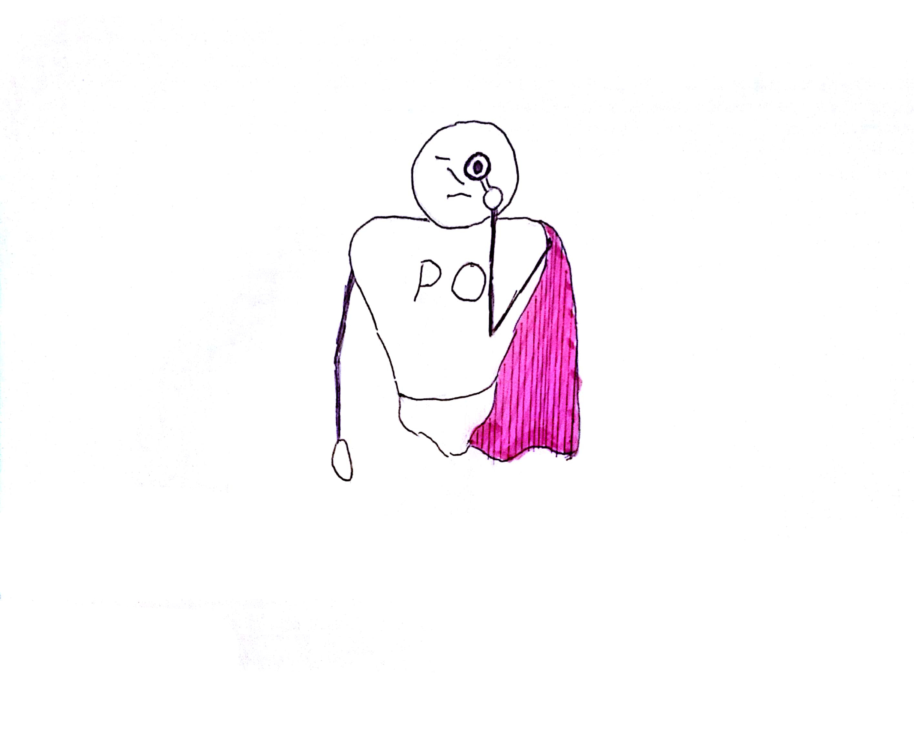

Note: But my PO has a similar attitude. He thinks that if we apply TDD we tend to "polish the gold as he calls" it. What he cares about is "features, features, features". I get micromanaged.

??VERTICAL

"Frontline leaders must be empowerd without micromanagement from the top."
Note: "Pal, I've got news for you. Your boss can not micromanage you. Do you think I would have time to ask the General for every wall I'm gonna duck behind? Of course not."

??VERTICAL

Note: You are right. Sandro Mancuso wrote in his book "The Softwarecraftsman", that the techiques in the inner blue circle of XP practices are not context specific and therefore do not have to be authorized. So we are free to decide how we work on this level.

??VERTICAL

"Tactical Leaders must be confident that they clearly understand the strategic mission and Commander's Intent."
Note: "That is ok, but you must not lose sight on the vision of your boss, in this case the PO. It is your most important job to backup your boss. You must believe into the mission."

??VERTICAL

Note: What do you mean with believe. The PO is not my religion. 

??VERTICAL

"Leaders must be a true *believers* in the mission."
Note: "When the PO gives you a UserStory, do you believe this is the right thing to do? Do you trust the decisions of your supervisor."

??VERTICAL

Note: Well not always. To be honest very often I do not share his opinion, that we have to implement the 5th version of the GUI. I see other aspects in the software that need much more attention.

??VERTICAL

"Ask until you understand."

Note: "Well if you do not believe to the mission, how should you sell it to your teammates? If you do not share his opinion, how should you decide about the fiddly details that the PO can not decide. He has no experience in development. How could he ever decide about it?

So If you do not share his opinion you have to ask back. Let him explain why this specific decision is necessary right now. He needs to sell you his decision just as you had to sell the required diciplines to your team mates."

??VERTICAL
 

??VERTICAL
 
Note: But after all discussion and finding a way together, you have to backup your supervisor. You need to present his mission as your believe, even if you still opose your bosses opinion. Only then you can uphold the moral in the team and ensure that they keep on the discipline you arranged with them. And only then you have the freedom you gain from discipline.

??VERTICAL
## Decentralized Command:

* Believe in your mission. <!-- .element: class="fragment" -->
* Understand not just what to do but why you should do it. <!-- .element: class="fragment" -->
* Have implicit trust that your senior leader bill back their decisions. <!-- .element: class="fragment" -->
* All levels must be empowerd to make decisions. <!-- .element: class="fragment" -->