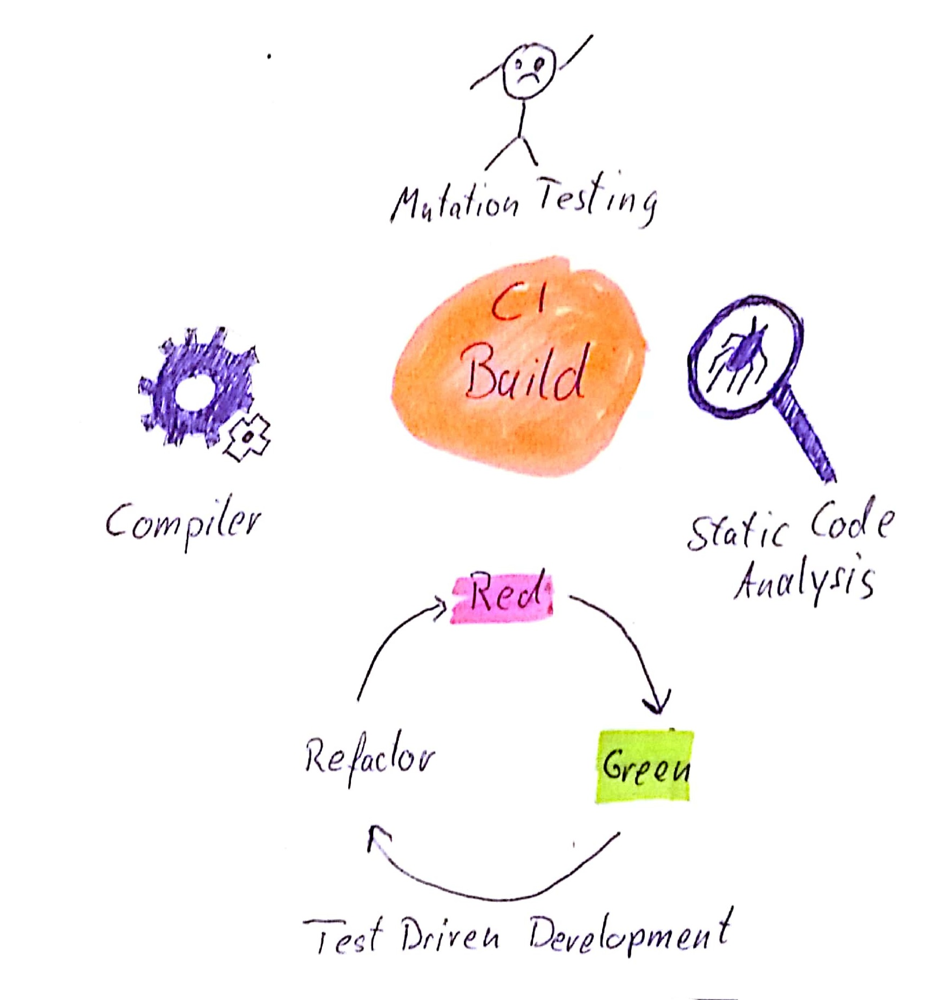

Note: Now that we know the core of Extreme Ownership, let's dive deeper and see what other
implications come out of it. We asume that our Product Owner comes to us with a great new idea. He thinks all our customers need the functionality to list the numbers from 1 to n. But because market research had shown that our customers are superstitious and see happiness in a three and and badluck in a five we shall not handle all numers the same way. Instead the PO want's us to replace each dividable by three with "fizz" and each dividable by five with "buzz".

??VERTICAL
```
function fizzbuzz (n) {
    if((n % 3 === 0 ) && (n % 5 === 0)) return "fizzbuzz"
    if (n % 5 === 0) return "buzz"
    if (n % 3 === 0) return "fizz"
    return String(n)
}
```
Note: So the core of that functionality is a function that can convert a number into a string. And depending on the devidability of that number it might convert it to fizz, buzz or even fizzbuzz if the number is devidable by 3 and 5 like this is true for 15. (I took a very simple computer science problem, because we want to concentrate less on the problem it self but on everything around it.)
A naive solution to tdhis problem might look like this. You just define several if-clauses each for one of the described usecases. You should recognize, that the algorith depends on the order of the if-clauses. If the fizzbuzz clause whould not be at the top, we would never hit it. This solution might be easy but it is not simple.

??VERTICAL

"Simple is not easy!"

??VERTICAL

Note: Yes, you are right. But let's explain this to the audience. Imagine the product owner comes enthusiastically to us and telling us that our product swept the market. We would vanquish if we only implement this little one additional feature if all numbers devideable by 7 would be replaced with "zuzz".

??VERTICAL
```
function fizzbuzz (n) {
    if((n % 3 === 0 ) && (n % 5 === 0) && (n % 7 === 0))return "fizzbuzzzuzz"
    if((n % 3 === 0 ) && (n % 7 === 0)) return "fizzzuzz"
    if((n % 5 === 0 ) && (n % 7 === 0)) return "buzzzuzz" 
    if((n % 3 === 0 ) && (n % 5 === 0)) return "fizzbuzz"
    if (n % 7 === 0) return "zuzz"
    if (n % 5 === 0) return "buzz"
    if (n % 3 === 0) return "fizz"
    return String(n)
}```

Note: I hope you recognize that we had to implement 4 new if-clauses to realize the wanted feature. In addition we had to take care where to sort in those if-clauses as well. The next time when we might have to modify this function this issue gets even worse.

??VERTICAL

Note: This was a very simple example of what happens to many code repositories over time. Every feature better should have been implemented yesterday so we emphasize only on finishing new features. The code gets worse each time a new feature has to be inserted because there is "no time to polish the gold".

But if the code gets more complex, each time we will touch it we will need more time to insert a new feature since we have to reunderstand it again and again. If my team mate was not aware of the order issue, he or she might insert a new if clause in the wrong place and it might take hours to find out why the function is not working as expected. So the performance of the team will go down over the time and the cost for each new feature raises exponentionally after each release.

??VERTICAL

Note: Well cleaning up in this case means refactoring. I would have to modify the code so that it gets simpler but still brings the same functionality. But how can I be sure that this is the case? How can I guarantee that my code does not break?

??VERTICAL

"Discipline means freedom"

Note: "I can tell you, if we would not organize ourselfes in the battle, we might find ourselves in a blue-on-blue. When you are in urban combat, it might happen that you are ducking inside a house and another platoon of your brothers is sitting in the neighbourhouse. But neither of those two parties know that the party in the neighbour house is friendly and somehow a shooting starts. It is one of the worst things that can happen in the battlefield. But we organize ourselfes by discipline. Discipline means freedom, in our case freedom to move securely in the battle field.

??VERTICAL

Note: Well in a good Development-Team you organize yourself around a so called Continious Build.
It means that everytime you modify the code and store it in the version controll system of your choice, a server takes on that modification and applies several qualitygates on it. One can be a socalled statical code analysis. If you work in a compiled language, the compilation of your code is another quality gate. But only when you practice TDD, you have a suite Tests that covers your codebase good enough to trust in its results so that you can be sure not to break the system when you refactor something. To know your Testsuite is good enough you can evan apply Mutationbased Testing.

??VERTICAL

"It's not what you preach, it's what you tolerate"
Note: So if you convince your team to adopt that technique and you do not tolerate any excusions, then this will work. It's not what you preach, it's what you tolerate!"

??VERTICAL
## Discipline

* Plan ahead <!-- .element: class="fragment" -->

* Specify rules <!-- .element: class="fragment" -->

* Ensure respectation of rules <!-- .element: class="fragment" -->

* Hurting the rules means hurting the team <!-- .element: class="fragment" -->

??VERTICAL
```
function fizz(n) {
    if (n % 3 === 0) return "fizz"
    return ""
}
function buzz(n) {
    if (n % 5 === 0) return "buzz"
    return ""
}
function fizzbuzz (n) {
    let result = fizz(n) + buzz(n)
    if (result === "")  return String(n)
    return result
}
```

??VERTICAL
```
...
function zuzz(n) {
    if (n % 5 === 0) return "buzz"
    return ""
}
function fizzbuzzzuzz (n) {
    let result = fizz(n) + buzz(n) + zuzz(n)
    if (result === "")  return String(n)
    return result
}
```