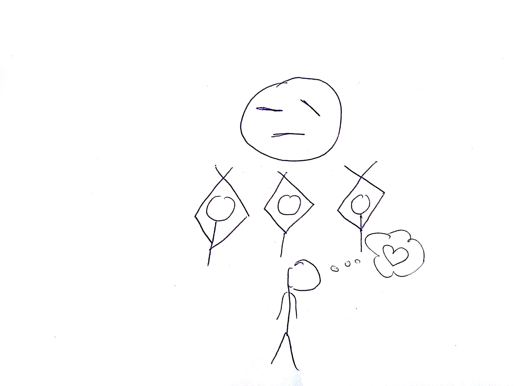

## Extreme Ownership applied to Software Development
  
Christian H&ouml;rauf 
@fonzygruen

Note: Hello welcome to this talk. Before we begin I would like to tell you a little story from

??HORIZONTAL

Note: ... my first job when I took some kind of responsibility for a project. I was young and a bit naive and
I still believed that if you would programm according to Design Patterns everything would be great in your software.

And Santa Claus is bringing the presents.

??VERTICAL

Note: So from all of the design patterns you can find in the book I mainly understood the Singleton. Well, if all you have is a hammer, everything looks like a nail. And today we know, that Singletons have more of an Antipattern than a valid Design Pattern. It happened the way it had to.

??VERTICAL

Note: So I let my Team implement Singletons. With time came the complexity but no
simplification in sight, so that the project took longer and longer. We missed the
release date by several weeks.

??VERTICAL

Note: My boss invited us to a meeting, in which he tried to find out what went wrong. He
asked how hard it would be to add this or that feature. And all the time I had to answer
that this won't work or might be quite complex.

??VERTICAL

Note: While I was explaining, the mood of my boss turned from indifferent to furious. His
questions got more and more aggressive.
I felt my stomach twist and got afraid what might happen here. Of course I might have
tried to accuse my team, since not everything they did was in my intent. But than I heard a voice in my head:

??VERTICAL

"Take Ownership and accept the failure"
Note: "Come on soldier you can not betray your comerades. Put your ego aside. You know that
it was  your design decisions are the reason for failing. Take ownership!"

??VERTICAL

Note: Somehow I wrestled down my feelings, especially since I admitted that the main issue
had been my Singleton-centered design.
So I managed to spell the words: "It was my fault". But then my Boss was about to
butcher me as a warning example for all the others.

??VERTICAL

Note: And although I already prepared myself for getting fired in the next moments, I found
my teammates stand up for me and explaining that all that stuff is not so easy as it might
seem. This was the most memorable moment of empathy in my career. Neither before or after
that I felt so connected to my team like in this moment.

??VERTICAL

Note: In the end, I did not get fired. Instead the face of my boss brightend. He accepted
the problems and I think he also was a little evnious that my team backed me up that much.

??VERTICAL

Note: Although it should take about ten more years of experince since I got in touch
with the book "Extreme Ownership", this was kind of my first glimpse on this concept that
contains so much truth and of which we will have a look at some of its main ideas.

??VERTICAL

Note: And this is... no sorry :)

??VERTICAL

Note: ... this is Jocko Willink, the voice I heard in my head and you can
listen him yourself, because he has his own Podcast "Jocko Podcast".

Leif Babin, have been Navy Seals in the war of Iraq, which raged between 2003-2011.
They have written the book "Extreme Ownership", in which they described the
discipline principles, that helped them to survive war and how they applied them to real
companies as management consultants.

??VERTICAL

  
Christian H&ouml;rauf 
@fonzygruen

Note: My name is Christian Hörauf, I currently work for Consorsbank, right here in
Nuremburg and I love TDD and Functional Programming.But before we continue, I want to clearify, that I have been conscentious objector
(Kriegsdienstverweigerer). I also object the questionable political interessts that backed
up the war in Iraq. And I object war in general. I even will not preach you each of Jocko
Willinks words, since with some I can not identify. But yet there is a lot truth in
Extreme Ownership and I think we would gain much better Software and much more Motivation
from our work if we apply it to our work. Therefore this is the topic of this talk: How can
we apply Extreme Ownership to Software development?

??VERTICAL
## Extreme Ownership
* take ownership for your mission <!-- .element: class="fragment" -->
* put your ego aside <!-- .element: class="fragment" -->
* it is always your fault <!-- .element: class="fragment" -->
* Extreme Ownership is contagious <!-- .element: class="fragment" -->

Note: So what does Extreme Ownership mean. First of all it means that you identify yourself
with your mission. You can not come at 9 and leave at 5 if your mission is not completed
yet. If it is important to you, you will do everything to make the mission work.

You take Ownership.

But it also means, that you accept, that if something goes wrong, that it is always
you, the leader, who failed. You can not blame the team. If the team fails it is still your failure since you did not communicate the mission goal properly to them.
If the circumstances seem to be unfair, it is up to you, the leader, to find ways to
compensate such bad circumstances and plan against upfront. So put your ego aside...

... and accept, that it is always your fault if something goes wrong. You
must not hide. But what we also already saw is: ...

... Extreme Ownership is contagious(ansteckend). If you act as a role model for your
team, your team will follow up. And also if your manager sees your team to work better, it
might also radiate up the chain of command and some day you will be surprised how honorable your manager acts upon you.

??VERTICAL
## Agenda
* Extreme Ownership
* Discipline <!-- .element: class="fragment" -->
* The Good Leader <!-- .element: class="fragment" -->
* Decentralized Command <!-- .element: class="fragment" -->
* Prioritize <!-- .element: class="fragment" -->
* Summary <!-- .element: class="fragment" -->