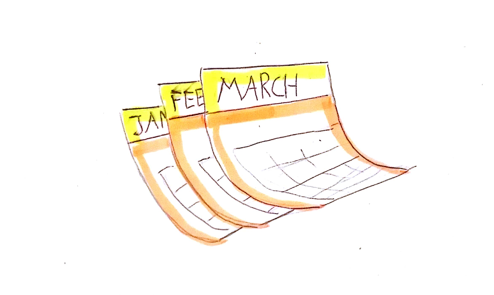

Note:
But you know. There are depencencies that really prevent the progress of my product. And of course I can plan against that to a specific ammount of time. But not for every hassel we have to face. For example, setting up a test environment takes our DevOps Team about 3 or more months. This means we have to wait several months to test our application in a production like environment.

??VERTICAL

Note:
What happens to the complete company is that several products face the same problem and each has to wait until DevOps is able to support it. This is not only bad for the company, because unfinished products mean delayed return on invest. On the otherhand it means, that we developers often get hit by several product releases at the same time.

??VERTICAL

Decisivly Engaged  

??VERTICAL

You have to win or you are lost!  

??VERTICAL
## Prioritize

1. Identify the bottleneck <!-- .element: class="fragment" -->

1. Optimize bottleneck <!-- .element: class="fragment" -->

1. Return to first step <!-- .element: class="fragment" -->

??VERTICAL

* Identified bottleneck: Testenvironment Setup <!-- .element: class="fragment" -->

* Optimize bottleneck: Move Testenvironment to Cloud <!-- .element: class="fragment" -->

* Identified bottleneck: Old Stager knows Guts of System <!-- .element: class="fragment" -->

* Optimize bottleneck: Let him instruct others <!-- .element: class="fragment" -->

* ... <!-- .element: class="fragment" -->
