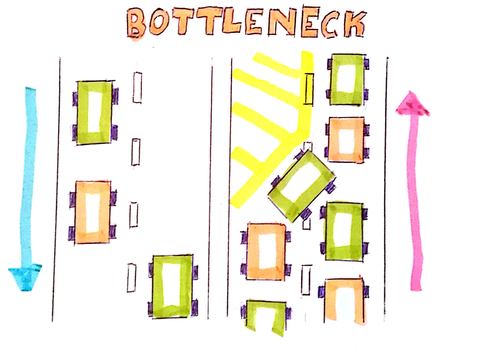
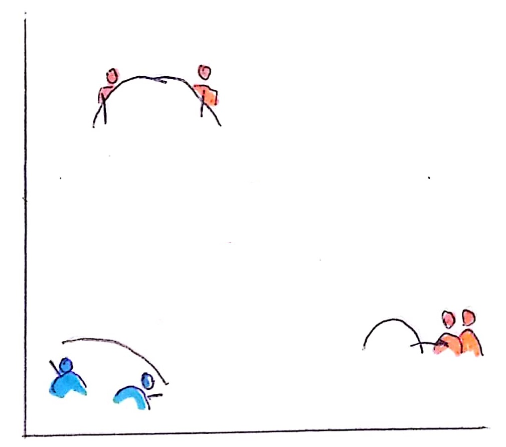
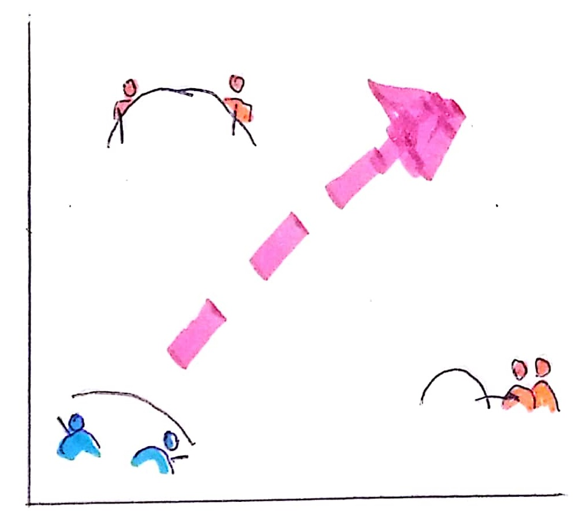

Note:
What happens to the complete company is that several products face the same problem and each has to wait until DevOps is able to support it. This is not only bad for the company, because unfinished products mean delayed return on invest. On the otherhand it means, that we developers often get hit by several product releases at the same time.

??VERTICAL

Decisivly Engaged  

??VERTICAL

You have to win or you are lost!  

??VERTICAL
## Prioritize

1. Identify the bottleneck <!-- .element: class="fragment" -->

1. Optimize bottleneck <!-- .element: class="fragment" -->

1. Return to first step <!-- .element: class="fragment" -->
