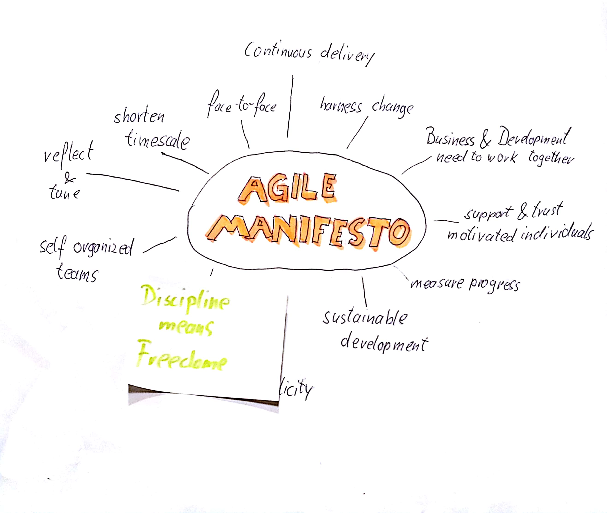

## Summary
* "Take ownership" means that failure is always your fault <!-- .element: class="fragment" -->
* Discipline gives you freedom to simply accept feature requests <!-- .element: class="fragment" -->
* Be a good leader by displaying what you tolerate and mentor underperformers <!-- .element: class="fragment" -->
* The best leader is the one, that is not necessary meanwhile battle <!-- .element: class="fragment" -->

??VERTICAL

Note: So what has all this to do with you and your daily work? Probably you are working in Scrum-Teams, where you neither have leaders nor are you one to apply Extreme Ownership. Right?
Let's have a look to some aspects of Scrum and Agility 

??VERTICAL

Note: First of all Scrum has been inveted by Jeff Sutherland and Ken Schwaber. Both spend some Time of their careers in the american army.
Wait a minute. Just like Jocko! Hm. Well at least you can say that both might have similar experiences in their army training. Could
there be some parallels beetween Extreme Ownership and Agility?

??VERTICAL

??VERTICAL

??VERTICAL

??VERTICAL

??VERTICAL

Note: The Agile Manifest is setup by 4 values AND 12 Principles. 
Let's randomly pick some of those principles:
Continuous attention to technical excellence and good design enhances agility. => Discipline means feedom
Simplicity--the art of maximizing the amount 
of work not done--is essential => Simple is not easy
The most efficient and effective method of 
conveying information to and within a development 
team is face-to-face conversation => You must lead up and down the chain of command.
The best architectures, requirements, and designs 
emerge from self-organizing teams. => Decentralized Command

??VERTICAL
## Extreme Ownership is nothing but another view to Agility

??VERTICAL

Note: What does this mean to us as developers? I would say:
Weather you carry some kind of title or not: Be the leader.
Convince your team to be Leaders. 
Tell them how important it is to take ownership.
Apply this mental attitude to your work and suddenly you will
see how the rules you previously learned from a Scrum-Coach
will make sense.
